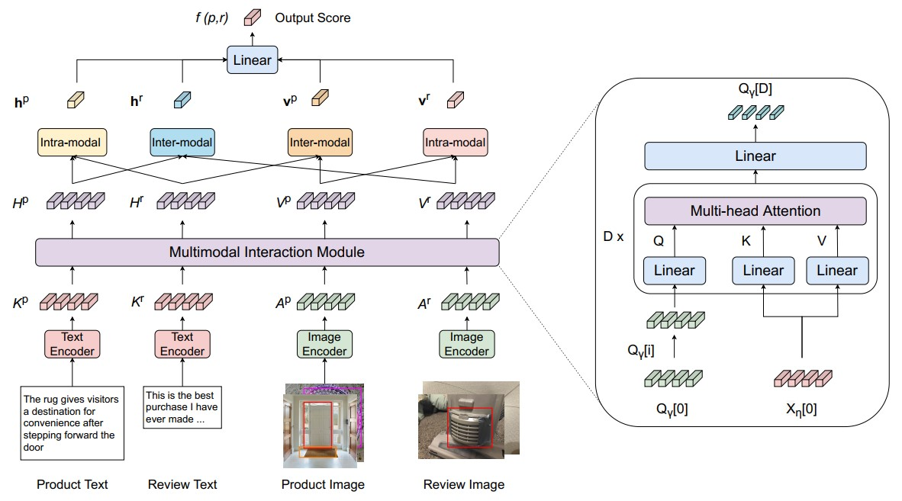

# Adaptive Contrastive Learning on Multimodal Transformer for Review Helpfulness Predictions

This repository includes the implementation of the paper [Adaptive Contrastive Learning on Multimodal Transformer for Review Helpfulness Predictions
](https://arxiv.org/abs/2211.03524).
Thong Nguyen, Xiaobao Wu, Anh-Tuan Luu, Cong-Duy Nguyen, Zhen Hai, Lidong Bing --- EMNLP 2022



In this paper, we propose methods to polish representation learning for the Multimodal Review Helpfulness Prediction (MRHP) task. In particular, we advance cross-modal relation representations by learning mutual information through contrastive learning. We also propose an adaptive weighting strategy to encourage flexiblity in contrastive objective optimization. Moreover, we integrate a cross-modal interaction module to relax the model’s reliance upon the unalignment nature among modalities, further refining multimodal features. Our framework outperforms prior baselines in the MRHP problem.

## Requirements
- scikit-learn
- Pillowspacy
- torch
- tabulate
- nltk
- numpy
- tqdm
- dill
- hyperopt
- pandas
- networkx
- h5py
- coverage
- codecov
- pytest
- pytest-cov
- cytoolz
- transformers
- prefetch_generator

## How to Run
1. To prepare the multimodal datasets of Lazada-MRHP and Amazon-MRHP, we follow the guideline provided here.
2. Run the following command to execute the training procedure:
``bash ./scripts/{dataset}/train_{segment}.sh``
For example,
    ```
    bash ./scripts/amazon/train_home.sh
    ```
    or
    ```
    bash ./scripts/amazon/train_clothing.sh
    ```
    
## Acknowledgement
Our implementation is based on the [MCR](https://github.com/jhliu17/MCR) code for the MRHP task.

## Citation
If you use this code, please cite the paper using the BibTex reference below.
```bibtex
@article{nguyen2022adaptive,
  title={Adaptive Contrastive Learning on Multimodal Transformer for Review Helpfulness Predictions},
  author={Nguyen, Thong and Wu, Xiaobao and Luu, Anh-Tuan and Nguyen, Cong-Duy and Hai, Zhen and Bing, Lidong},
  journal={arXiv preprint arXiv:2211.03524},
  year={2022}
}
```